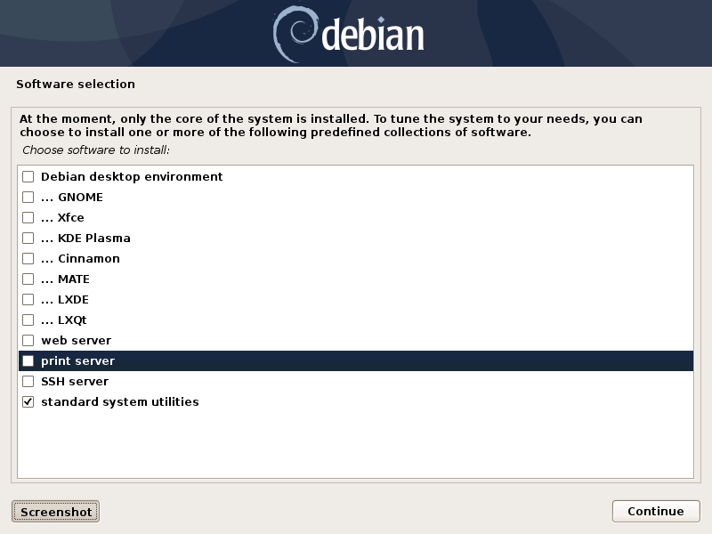

Debian base installation
========================

.. contents:: Page content
  :local:
  :backlinks: entry

.. highlight:: shell

.. index::
  pair: Debian; stable

Introduction
------------

These are my notes about the installation of a `Debian GNU/Linux
<https://www.debian.org>`_ system on a 64-bit ("AMD64" architecture) PC. A
significant part of these notes describes the preparation of the installation
medias. The assumption is made that you have access to a working machine with a
Debian GNU/Linux system installed and a fast enough internet connection (to
download a few hundreds of megabytes). This machine will be used to prepare the
installation medias for the new system.

Most of the software packages are also downloaded during the installation, so
the target machine should also have a fast enough internet connection.

The easiest way nowadays is probably to make a bootable USB stick. I used to
make a `"netinst" CD <https://www.debian.org/CD/netinst>`_, but Debian
"netinst" images have become bigger and they don't fit on a 700MB CD-ROM
anymore.

.. _getting_debian_iso_image:

Making a bootable USB stick
---------------------------

.. index::
  triple: Debian; stable; installer
  single: wget
  single: cp
  single: sync

Just download the tiny (64MB) "netboot" image (mini.iso) and write it (**as
root**) to the device corresponding to your USB stick (e.g. ``/dev/sdc``, check
using ``lsblk``)::

  wget https://deb.debian.org/debian/dists/testing/main/installer-amd64/current/images/netboot/mini.iso
  cp mini.iso /dev/sdc; # As root.
  sync; # As root.

Getting an installation CD
--------------------------

.. index::
  triple: Debian; stable; installer
  single: wget
  single: cdrskin
  pair: ISO image; burning
  single: dd
  single: stat
  single: sha512sum
  single: gpg

If you choose to go the CD-ROM route, here is what you need to do. The provided
URLs are for Debian 13.0.0 (Trixie). Note also that it is assumed that you have
`cdrskin <http://scdbackup.sourceforge.net/cdrskin_eng.html>`_ installed. Run
``apt-get install cdrskin`` **as root** if not. Note also that the
``dev=<cd_burning_drive_device_file>`` option is probably not mandatory as
cdrskin can detect CD burning devices (``cdrskin --devices`` lists the detected
devices)::

  wget https://cdimage.debian.org/debian-cd/current/amd64/iso-cd/debian-13.0.0-amd64-netinst.iso
  cdrskin dev=<cd_burning_drive_device_file> -eject -v -data debian-13.0.0-amd64-netinst.iso

You might want to verify the authenticity of the ISO image. Download the SHA512
checksum and associated signature file::

  wget https://cdimage.debian.org/debian-cd/current/amd64/iso-cd/SHA512SUMS
  wget https://cdimage.debian.org/debian-cd/current/amd64/iso-cd/SHA512SUMS.sign

Then, attempt to verify the authenticity of the image::

  gpg --verify SHA512SUMS.sign

If there are lines like the following in the output, it means that you have
never imported the key used to sign the image (and this is confirmed by the
fact that it does not appear in the output of ``gpg --list-keys``). 

| gpg:                using RSA key DF9B9C49EAA9298432589D76DA87E80D6294BE9B
| gpg: Can't check signature: No public key

You can import the key with::

  gpg --keyserver keyring.debian.org --recv DF9B9C49EAA9298432589D76DA87E80D6294BE9B

A new attempt to check the signature with ``gpg --verify SHA512SUMS.sign`` now
produces a line like

| gpg: Good signature from "Debian CD signing key <debian-cd@lists.debian.org>"

When the burning is done, you might also want to check the integrity of the
burned CD. Just compare the output of the following command with the checksum
from the downloaded checksum file as provided in file SHA512SUMS::

  dd if=/dev/<cd_burning_drive_device_file> bs=2048 \
    count=$(($(stat -c %s debian-13.0.0-amd64-netinst.iso)/2048)) \
    conv=notrunc,noerror | sha512sum

Disk partitioning
-----------------

Choosing the amount of swap space
~~~~~~~~~~~~~~~~~~~~~~~~~~~~~~~~~

.. index::
  single: swap

I tend to follow the recommendations provided in this article by Abhishek
Prakash: https://itsfoss.com/swap-size.

Choosing the partitioning scheme
~~~~~~~~~~~~~~~~~~~~~~~~~~~~~~~~

.. index::
  single: hard drive partitioning scheme

When disk encryption is not wanted (and with legacy BIOS mode boot)
___________________________________________________________________

.. index::
  single: SSD

If the machine has only one hard drives, I choose a simple partitioning scheme:
a single ``/`` partition plus a swap partition. I find it easy enough to set up
(using either the "Guided - use entire disk" or "manual" method proposed by the
Debian installer).

If the machine has one `SSD <https://en.wikipedia.org/wiki/Solid-state_drive>`_
and one `traditional spinning hard disk drive
<https://en.wikipedia.org/wiki/Hard_disk_drive>`_, I choose the following
partitioning scheme:

  * ``/`` partition on SSD (20GB).
  * ``/usr`` partition on SSD.
  * ``/var`` partition on spinning HDD (20GB).
  * ``/tmp`` partition on spinning HDD (10GB).
  * swap partition on spinning HDD.
  * ``/home`` partition on spinning HDD.

(This link was helpful: https://unix.stackexchange.com/a/89230).

When disk encryption is wanted (and with UEFI mode boot)
________________________________________________________

.. index::
  single: LVM
  single: Disk encryption
  single: ESP
  single: UEFI

I've setup disk encryption once on a 2022 laptop with a single hard drive. I've
done it using the "Guided - use entire disk and set up encrypted LVM" method
proposed by the Debian installer. It is of course possible to do it using the
"manual" method, but I find it too easy to forget something (e.g. `ESP
<https://en.wikipedia.org/wiki/EFI_system_partition>`_ partition, ``/boot``
partition).

I struggled to set up the wanted swap space size, but eventually understood I
had to go into "Configure the Logical Volume Manager", delete the logical
volumes and create them again with the wanted sizes.

Postponing the installation of a graphical environment
------------------------------------------------------

.. index::
  single: desktop environment

During Debian installation, you arrive at this screen.

Checking none of the desktop environment results obviously in no desktop
environment installed. But it is possible to install one (including one that
was not proposed by the Debian installer) later.

Shutting down and rebooting a Debian system
-------------------------------------------

.. index::
  pair: systemctl commands; poweroff
  pair: systemctl commands; reboot
  single: system-run
  single: shutdown

After the installation, you should be able to boot into the newly installed
system and log in as root or normal user. But it may not be obvious how to
shutdown or reboot the system::

  systemctl poweroff # Shut down.
  systemctl reboot   # Reboot.

You can delay the execution of the command::

  system-run --on-active=90 systemctl poweroff # Shut down in 90 seconds.

Alternatively, you can use the ``shutdown`` command::

  shutdown    # Power-off the machine in 1 minute.
  shutdown +2 # Power-off the machine in 2 minutes.

Immediate post-install actions
------------------------------

This section describes what I usually do after booting into the newly installed
Debian system.

Fixing the slow boot issue
~~~~~~~~~~~~~~~~~~~~~~~~~~

.. index::
  triple: TSSTcorp; CD/DVD-RW drive; SH-S223C
  single: slow boot issue
  single: udevadm
  single: sed
  single: update-initramfs
  single: /lib/udev/rules.d/60-persistent-storage.rules
  single: ATAPI

A former machine of mine was affected by the
`TSSTcorp <https://en.wikipedia.org/wiki/Toshiba_Samsung_Storage_Technology>`_
CDDVDW `SH-S223C
<https://www.newegg.com/samsung-model-sh-s223c-dvd-burner/p/N82E16827151192>`_
related slow boot issue. You can check if you have this particular CD/DVD-RW
drive with this command (assuming your optical drive is associated with device
``/dev/sr0``)::

  udevadm info -a -p  $(udevadm info -q path -n /dev/sr0) | grep model

The fix involves changing file
``/lib/udev/rules.d/60-persistent-storage.rules`` **and then** regenerating the
initramfs image (**as root** for both operations)::

  update-initramfs -u # As root, regenerates the initramfs image.

As for the change to ``/lib/udev/rules.d/60-persistent-storage.rules``, the
internet gives two solutions:

* Commenting out entirely the ATAPI device rule using this command::

    sed -i '/ATAPI/,+1s/^/#/' /lib/udev/rules.d/60-persistent-storage.rules # As root.

* Cancelling the rule for the SH-S223C only, as suggested in `Debian bug
  #622340 <https://bugs.debian.org/cgi-bin/bugreport.cgi?bug=622340#43>`_. This
  is what I was doing.

Note that the change to ``/lib/udev/rules.d/60-persistent-storage.rules`` and
the regeneration of the initramfs image have to be redone after each update of
the ``udev`` Debian package (because
``/lib/udev/rules.d/60-persistent-storage.rules`` is overwritten and the
initramfs image regenerated by the update).

System update
~~~~~~~~~~~~~

.. index::
  pair: apt-get commands; update
  pair: apt-get commands; dist-upgrade
  single: /var/run/reboot-required

Update the system **as root** with::

  apt-get update       # As root.
  apt-get dist-upgrade # As root.

After an update, the presence of file ``/var/run/reboot-required`` indicates
that a reboot is required due to a new kernel or to the update of a critical
library.

Preventing the system from beeping
~~~~~~~~~~~~~~~~~~~~~~~~~~~~~~~~~~

.. index::
  single: lsmod
  single: /etc/modprobe.d
  single: beep
  single: pcspkr
  pair: Kernel module; blacklisting

The newly installed system may emit beeps quiet often (for example when working
in a terminal emulator). To stop that, you can blacklist module ``pcspkr`` by
adding a file **as root** in ``/etc/modprobe.d`` (file name suggestion:
``nobeep.conf``). The file should contain this line::

  blacklist pcspkr

After rebooting the system, module ``pcspkr`` should not be loaded any more
(i.e. ``lsmod | grep pcspkr`` should output nothing) and you should not hear
beeps any more.

Adding support for other languages
~~~~~~~~~~~~~~~~~~~~~~~~~~~~~~~~~~

.. index::
  single: locales
  single: languages
  single: dpkg-reconfigure

When installing the system, I select the English language, but I sometimes want
to see an application in French. So I run (**as root**)::

  dpkg-reconfigure locales # As root.

and select the french language (and don't unselect anything).

Then if I occasionally want to run an application (e.g. Gimp) in French, I can
do (as "normal" user)::

  export LANG=fr_FR.UTF-8
  export LANGUAGE=fr_FR.UTF-8
  gimp &

More details on the locales on the `Debian Wiki locale page
<https://wiki.debian.org/Locale>`_

.. _add_debmultimedia:

Adding deb-multimedia to the sources
~~~~~~~~~~~~~~~~~~~~~~~~~~~~~~~~~~~~

.. index::
  single: /etc/apt/sources.list
  single: deb-multimedia.org
  pair: apt-get commands; update
  pair: apt-get commands; dist-upgrade
  pair: apt-get commands; install

You may want to add deb-multimedia as a source of packages for the newly
installed Debian system (see `this linuxconfig.org article
<https://linuxconfig.org/amp-up-your-multimedia-experience-on-debian-9-stretch-linux>`_).

http://deb-multimedia.org provides some instructions:

First, add **as root** a line like this one (example for Debian 13 (Trixie)) in
your ``/etc/apt/sources.list``:

| deb https://www.deb-multimedia.org trixie main non-free

Then, issue **as root** the following commands::

  apt-get update -oAcquire::AllowInsecureRepositories=true
  apt-get install deb-multimedia-keyring
  apt-get update
  apt-get dist-upgrade

Installing firmware-linux-nonfree
~~~~~~~~~~~~~~~~~~~~~~~~~~~~~~~~~

.. index::
  single: firmware-linux-nonfree
  single: /etc/apt/sources.list

Depending on your hardware, you may not need the ``firmware-linux-nonfree``. On
my machines, this package makes life easier (most notably with Wi-Fi network
adapter and/or graphics) and is installed either during installation (if the
firmware archive has been required) or post-installation, manually::

  apt-get install firmware-linux-nonfree # As root.

Note that the ``/etc/apt/sources.list`` file must have the non-free section
(and even **the non-free-firmware section**, starting with Debian 12).

You can :download:`download my /etc/apt/sources.list for Debian 13
<download/sources.list>`.

Make sure you issue a ``apt-get update`` command after changing
``/etc/apt/sources.list``.

Checking the configured time zone
~~~~~~~~~~~~~~~~~~~~~~~~~~~~~~~~~

.. index::
  single: /etc/timezone
  single: /etc/localtime
  single: tzdata
  single: dpkg-reconfigure

Check the configured time zone with::

  cat /etc/timezone # For Debian 12 (Bookworm) and earlier.

or::

  ls -l /etc/localtime # Starting with Debian 13 (Trixie).

If the configuration is not correct, you can change it **as root** with::

  dpkg-reconfigure tzdata # As root.

Checking systemd-timesyncd service
~~~~~~~~~~~~~~~~~~~~~~~~~~~~~~~~~~

.. index::
  single: systemd-timesyncd
  single: /etc/systemd/timesyncd.conf
  single: /run/systemd/timesync/synchronized
  single: stat

Service systemd-timesyncd (network time synchronization service) should have
been automatically enabled::

  systemctl status systemd-timesyncd

You can find the lastest synchronization date by checking the modification time
of file ``/run/systemd/timesync/synchronized``::

  stat /run/systemd/timesync/synchronized|grep ^Modif

The configuration file for systemd-timesyncd is
``/etc/systemd/timesyncd.conf``.

Installing a console locker
~~~~~~~~~~~~~~~~~~~~~~~~~~~

.. index::
  single: physlock

There are many screen and/or console locker programs. I've installed `physlock
<https://github.com/muennich/physlock>`_::

  apt-get install physlock # As root.

Installing a memory (RAM) tester
~~~~~~~~~~~~~~~~~~~~~~~~~~~~~~~~

.. index::
  triple: Random Access Memory (RAM); tester; memtest86+
  single: Memtest86+
  single: Grub

RAM failures are not so rare in my experience. A tester like `Memtest86+
<https://www.memtest.org/>`_ can really help diagnosing a RAM failure. The
``apt-get install`` command below installs Memtest86+ and adds an entry in the
`Grub <https://en.wikipedia.org/wiki/GNU_GRUB>`_ menu (you have to reboot your
machine and select the Memtest86+ grub entry to start Memtest86+)::

  apt-get install memtest86+ # As root.

On one of my machines (a 2022 laptop), Memtest86+ did not work (black screen,
possibly because `Secure Boot
<https://www.businessinsider.com/guides/tech/what-is-secure-boot>`_ was
enabled). I tried `Memtest86 <https://www.memtest86.com/>`_, more precisely
`its (unsupported) ISO image
<https://www.memtest86.com/tech_booting-cd-dvd.html>`_, which worked.

I downloaded and burned the ISO image to a blank CD-R using the following
commands::

  wget https://www.memtest86.com/downloads/memtest86-iso.zip
  unzip memtest86-iso.zip
  cdrskin -eject -v -data memtest86-iso.iso

Installing a wireless devices status management tool
~~~~~~~~~~~~~~~~~~~~~~~~~~~~~~~~~~~~~~~~~~~~~~~~~~~~

.. index::
  single: wireless devices status
  single: rfkill

On a laptop computer, it may be useful to check the status (enabled, hard
blocked, soft blocked) of the wireless devices. Package ``rfkill`` makes that
possible::

  apt-get install rfkill # As root.

Check the statuses with::

  /usr/sbin/rfkill list

Installing a CD burning tool
~~~~~~~~~~~~~~~~~~~~~~~~~~~~

.. index::
  single: cdrskin
  single: CD burning

I use cdrskin to burn CDs (in particular the Debian installation CDs) on an
internal or external (USB) CD burning drive::

  apt-get install cdrskin # As root.

Creating new users
~~~~~~~~~~~~~~~~~~

.. index::
  single: adduser
  single: /etc/adduser.conf
  single: chmod

Check whether the ``DIR_MODE`` (default permissions for users home directories)
setting in file ``/etc/adduser.conf`` is appropriate for your needs. The
default value is nox "0700" (which seems OK to me) but it used to be "0755".
"0755" implies that any unprivileged user have read access to the files of
other users. You may want to change (**as root**) the value to "0700" to avoid
that::

  sed -i s/DIR_MODE=0755/DIR_MODE=0700/ /etc/adduser.conf

Then, to create a new user, just use the ``adduser`` script (**as root**)::

  adduser new_user_name

If some users have already been created with inappropriate home directories
permissions, you can update their home directories permissions with a command
like (**as root**)::

  chmod 700 /home/*

Creating a "super user" account, disabling root login
~~~~~~~~~~~~~~~~~~~~~~~~~~~~~~~~~~~~~~~~~~~~~~~~~~~~~

.. index::
  single: sudo
  single: adduser
  single: usermod

You may want, for security reasons, to use an account other than root to
perform administrative tasks (via sudo), and to disable root login.

Make sure ``sudo`` is installed::

  apt-get install sudo

Create (**as root**) a new user (the new "super user")::

  adduser super_user_user_name

Add (**as root**) the "super user" to the ``sudo`` group::

  usermod -aG sudo super_user_user_name

Disable root login (**as the "super user"**, via ``sudo``)::

  sudo usermod -L root

.. _installing_locate_updatedb:

Installing locate / updatedb
~~~~~~~~~~~~~~~~~~~~~~~~~~~~

.. index::
  single: locate
  single: updatedb
  single: anacron
  single: /etc/crontab
  single: /etc/cron.daily

Command ``locate`` is a way of finding files on your computer. It is faster
than ``find``. It relies on a database generated using program ``updatedb``.
The database is updated daily via the script ``/etc/cron.daily/locate``
(directory ``/etc/cron.daily`` should appear in file ``/etc/crontab``).

Install locate and updatedb with::

  apt-get install locate # As root.

If you don't leave your machine running all the time, the database update may
not happen every day if package ``anacron`` is not installed. You can install
it (**as root**) with::

  apt-get install anacron # As root.

You can force the database update **as root** with::

  updatedb # As root.

You can see various statistics about the database, including the last time it
has been changed, with option ``-S``::

  locate -S

If the users home directories are not world-readable, then the files they
contained won't appear in the database. In this case, users may want to
generate their own database, with a command like::

  updatedb --output=/home/$USER/.locatedb 2>/dev/null

or::

  updatedb \
      --prunepaths='/tmp /usr/tmp /var/tmp /afs /media' \
      --output=/home/$USER/.locatedb 2>/dev/null

(The ``--prunepaths`` option instructs ``updatedb`` to ignore the listed paths.
By default, ``/tmp``, ``/usr/tmp``, ``/var/tmp`` and ``/afs`` are ignored and I
added ``/media`` to prevent ``updatedb`` from exploring any mounted drive.)

Users can use the ``-d`` option of command ``locate`` to search in their
database. The database contains the files in their home directory and also the
system files they have permissions to see::

  locate -d ~/.locatedb <search_pattern>

Users can add an entry to their ``crontab`` to automate the generation of their
database. See the :doc:`Reminder page <reminder>` for an example of ``crontab``
entry.

Post-install maintenance
------------------------

.. index::
  pair: apt-get commands; update
  pair: apt-get commands; dist-upgrade
  pair: apt-get commands; autoremove
  pair: apt-get commands; autoclean
  single: dpkg
  single: ar
  single: tar
  single: rm
  single: diff

I regularly run the following commands to keep the system up to date::

  apt-get update && apt-get dist-upgrade
  apt-get autoremove # Useful if some packages have become unneeded.
  apt-get autoclean  # Useful to avoid that the APT cache grows out of control.

The package management system (`APT
<https://en.wikipedia.org/wiki/APT_(software)>`_) logs to files in
``/var/log/apt``. ``/var/log/apt/term.log`` is not easy to read due to ``^M``
characters. When I need to read it, I make a copy of it and edit the copy in
Vim to remove the ``^M`` characters (``:%s/<Crl-V><Ctrl-M>/\r/g``).

After, say, a major upgrade, you might want to find which of your configuration
files are different from the default configuration files. I wrote the following
shell script which helps answering the question.

It's meant to be run **as root, in an empty directory created for the
occasion**.

Here is a short description of the script:

For every installed package on the system, the script searches the ``.deb``
file (found in ``/var/cache/apt/archives``) for the list of configuration files
for the package (file ``conffiles`` in the ``control.tar`` archive of the
``.deb`` file).

For every configuration file, the default version of the file (as found in the
``data.tar`` archive of the ``.deb`` file) is compared (using ``diff``) with
the installed version.

Of course, there are some particular cases which are not handled by the script.
For example, for the package ``openssh-server``, the configuration file
``/etc/ssh/sshd_config`` is not mentionned in ``conffiles`` (and the default
version is ``/usr/share/openssh/sshd_config``).

And here is the code::

  #!/bin/sh

  set -o nounset
  set -o errexit

  APT_ARCHIVE_DIR=/var/cache/apt/archives;
  CONF_FILE_LIST=conffiles;
  CTRL_ARCHIVE=control.tar;

  dpkg -l \
      | grep ^ii \
      | while IFS= read -r LINE; do

            LINE_TAIL="$(echo "$LINE" | sed "s/^ii\s\+//")";
            PACKAGE_NAME="$(echo "$LINE_TAIL" | sed "s/\([^ :]\+\).\+$/\1/")";
            LINE_TAIL="${LINE_TAIL#$PACKAGE_NAME}";
            LINE_TAIL="$(echo "$LINE_TAIL" | sed "s/^\(:[^ ]\+\)\?\s\+//")";
            PACKAGE_VER="$(echo "$LINE_TAIL" | sed "s/\([^ ]\+\).\+$/\1/")";
            PACKAGE_VER="$(echo "$PACKAGE_VER" | sed "s/:/%3a/g")";
            LINE_TAIL="$(echo "$LINE_TAIL" | sed "s/^[^ ]\+\s\+//")";
            PACKAGE_ARCH="${LINE_TAIL%% *}";
            PACKAGE_DEB="${PACKAGE_NAME}_${PACKAGE_VER}_${PACKAGE_ARCH}.deb";

            PACKAGE_DEB_PATH="$APT_ARCHIVE_DIR/$PACKAGE_DEB";

            if [ -f "$PACKAGE_DEB_PATH" ]; then

                rm -rf "$PACKAGE_NAME";
                mkdir "$PACKAGE_NAME";
                cd "$PACKAGE_NAME";

                cp "$PACKAGE_DEB_PATH" .;
                ar -x "$PACKAGE_DEB";

                if [ -f "$CTRL_ARCHIVE.xz" ]; then
                    COMPRESSED_CTRL_ARCHIVE=control.tar.xz;
                else
                    COMPRESSED_CTRL_ARCHIVE=control.tar.gz;
                fi;
                tar -xf "$COMPRESSED_CTRL_ARCHIVE";

                if [ -f "$CONF_FILE_LIST" ]; then

                    tar -xf data.tar.xz;

                    for CONF_FILE in $(cat "$CONF_FILE_LIST"); do
                        echo "*** $PACKAGE_NAME configuration file $CONF_FILE";
                        set +o errexit
                        diff "$CONF_FILE" "${CONF_FILE#/}";
                        set -o errexit
                    done;
                fi;

                cd ..;
                rm -rf "$PACKAGE_NAME";

            else

                echo "Cannot find $PACKAGE_DEB_PATH" 1>&2;

            fi;

        done;
