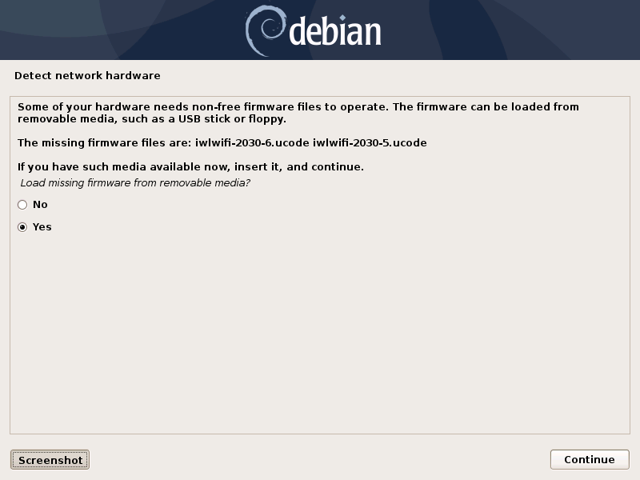

Debian base installation
========================

.. contents:: Page content
  :local:
  :backlinks: entry

.. highlight:: shell

Introduction
------------

These are my notes about the installation of a `Debian GNU/Linux
<https://www.debian.org>`_ system on a 64-bit ("AMD64" architecture) PC. A
significant part of these notes describe the preparation of the installation
medias. The assumption is made that you have access to a working machine with a
Debian GNU/Linux system installed a fast enough internet connection (to
download a few hundreds of megabytes). This machine will be used to prepare the
installation medias for the new system.

Many software packages are also downloaded during the installation, so the
target machine should also have a fast enough internet connection.

Getting an installation CD
--------------------------

.. index::
  pair: Debian; installer
  pair: Debian; installer
  single: wget
  single: cdrskin
  single: CD burning
  single: dd
  single: stat
  single: sha512sum
  single: gpg

See the `Getting Debian page <https://www.debian.org/distrib/>`_ for
information about how to download a Debian installer CD image or buy
installation CDs.

If you have a fast enough internet connection and a CD burning drive, you can
download a `small (approximately 300MB) installation image
<https://www.debian.org/distrib/netinst>`_ and burn it to a blank CD-R.
Commands like the ones below should do it. The example is for Debian 10.0.0
(Buster). Note also that it is assumed that you have `cdrskin
<http://scdbackup.sourceforge.net/cdrskin_eng.html>`_ installed. Run ``apt-get
install cdrskin`` **as root** if not. Note also that the
dev=<cd_burning_drive_device_file> option is probably not mandatory as cdrskin
can detect CD burning devices (``cdrskin --devices`` lists the detected
devices)::

  wget https://cdimage.debian.org/debian-cd/current/amd64/iso-cd/debian-10.0.0-amd64-netinst.iso
  cdrskin dev=<cd_burning_drive_device_file> -eject -v -data debian-10.0.0-amd64-netinst.iso

You might want to verify the authenticity of the ISO image. Download the SHA512
checksum and associated signature file::

  wget https://cdimage.debian.org/debian-cd/current/amd64/iso-cd/SHA512SUMS
  wget https://cdimage.debian.org/debian-cd/current/amd64/iso-cd/SHA512SUMS.sign

Then, attempt to verify the authenticity of the image::

  gpg --verify SHA512SUMS.sign

If there are lines like the following in the output, it means that you have
never imported the key used to sign the image (and this is confirmed by the
fact that it does not appear in the output of ``gpg --list-keys``). 

| gpg:                using RSA key DF9B9C49EAA9298432589D76DA87E80D6294BE9B
| gpg: Can't check signature: No public key

You can import the key with::

  gpg --keyserver keyring.debian.org --recv DF9B9C49EAA9298432589D76DA87E80D6294BE9B

A new attempt to check the signature with ``gpg --verify SHA512SUMS.sign`` now
produces a line like

| gpg: Good signature from "Debian CD signing key <debian-cd@lists.debian.org>"

When the burning is done, you might also want to check the integrity of the
burned CD. Just compare the output of the following command with the checksum
from the downloaded checksum file::

  dd if=/dev/<cd_burning_drive_device_file> bs=2048 \
    count=$(($(stat -c %s debian-10.0.0-amd64-netinst.iso)/2048)) \
    conv=notrunc,noerror | sha512sum

Preparing a media with firmware archive, just in case
-----------------------------------------------------

.. index::
  single: Debian firmware archive
  single: wget
  triple: archives; .tar.gz archives; tar
  single: sha512sum

Note that this step is **not necessary if your installation CD already includes
firmware** (that is if you have downloaded the image from a subdirectory of
cdimage.debian.org/cdimage/unofficial/non-free/cd-including-firmware).

The `Debian Wiki <https://wiki.debian.org/Firmware>`_ provides some
instructions, but here are the details of what I've done (for a Debian Buster
install, and including the authenticity verification of the archive)::

  mkdir -p ~/download/debian_buster_firmware # Create a directory somewhere.
  cd ~/download/debian_buster_firmware       # Move to that directory.

  # Download the firmware archive, its SHA512 checksum and associated signature
  # file.
  wget http://cdimage.debian.org/cdimage/unofficial/non-free/firmware/buster/current/firmware.tar.gz
  wget http://cdimage.debian.org/cdimage/unofficial/non-free/firmware/buster/current/SHA512SUMS

I've checked the SHA512 checksum of ``firmware.tar.gz`` by issuing a
``sha512sum firmware.tar.gz`` command and comparing the output with what is in
SHA512SUMS.

The final steps consisted in extracting the files from the firmware archive
(``tar xvzf firmware.tar.gz``) and copy all the files with ``.deb`` extension
to a "firmware" directory located at the root of a USB stick.

During Debian installation, plug in this USB stick when (and if) you get this
kind of screen:

Disk partitioning
-----------------

.. index::
  single: SSD
  single: hard drive partitioning scheme
  single: swap

At the disk partitioning stage, two non-trivial questions arise:

* Which partitioning scheme to choose (in particular on a machine with two hard
  drives (one `SSD <https://en.wikipedia.org/wiki/Solid-state_drive>`_ and one
  `traditional spinning hard disk drive
  <https://en.wikipedia.org/wiki/Hard_disk_drive>`_)? This link is helpful:
  https://unix.stackexchange.com/a/89230.

* What's the right amount of swap space? This article by Abhishek Prakash
  helps: https://itsfoss.com/swap-size.

I settled on the following partitioning schemes:

.. list-table::
  :header-rows: 1

  * - Machine with spinning HDD only
    - Machine with 128GB SDD + spinning HDD
  * - Single ``/`` partition + swap
    - * ``/`` partition on SSD (20GB).
      * ``/usr`` partition on SSD.
      * ``/var`` partition on spinning HDD (20GB).
      * ``/tmp`` partition on spinning HDD (10GB).
      * swap partition on spinning HDD.
      * ``/home`` partition on spinning HDD.

Postponing the installation of a graphical environment
------------------------------------------------------

.. index::
  single: desktop environment

During Debian installation, you arrive at this screen.

.. image:: image/debian_install_screenshot_tasksel_first_0.png

Checking none of the desktop environment results obviously in no desktop
environment installed. But it is possible to install one (including one that
was not proposed by the Debian installer) later.

Shutting down and rebooting a Debian system
-------------------------------------------

.. index::
  pair: systemctl commands; poweroff
  pair: systemctl commands; reboot

After the installation, you should be able to boot into the newly installed
system and log in as root or normal user. But it may not be obvious how to
shutdown or reboot the system::

  systemctl poweroff # Shut down.
  systemctl reboot   # Reboot.

Immediate post-install actions
------------------------------

This section describes what I usually do after booting into the newly installed
Debian system.

System update
~~~~~~~~~~~~~

.. index::
  pair: apt-get commands; update
  pair: apt-get commands; dist-upgrade

Update the system **as root** with::

  apt-get update       # As root.
  apt-get dist-upgrade # As root.

Adding deb-multimedia to the sources
~~~~~~~~~~~~~~~~~~~~~~~~~~~~~~~~~~~~

.. index::
  single: /etc/apt/sources.list
  single: deb-multimedia.org
  pair: apt-get commands; update
  pair: apt-get commands; dist-upgrade
  pair: apt-get commands; install

You may want to add deb-multimedia as a source of packages for the newly
installed Debian system (see `this linuxconfig.org article
<https://linuxconfig.org/amp-up-your-multimedia-experience-on-debian-9-stretch-linux>`_).

http://deb-multimedia.org provides some instructions:

First, add **as root** a line like this one (example for Debian Buster) in your
``/etc/apt/sources.list``:

| deb https://www.deb-multimedia.org buster main non-free

Then, issue **as root** the following commands::

  apt-get update -oAcquire::AllowInsecureRepositories=true
  apt-get install deb-multimedia-keyring
  apt-get update
  apt-get dist-upgrade

Checking the configured time zone
~~~~~~~~~~~~~~~~~~~~~~~~~~~~~~~~~

.. index::
  single: /etc/timezone
  single: tzdata
  single: dpkg-reconfigure

Check the configured time zone with::

  cat /etc/timezone

If the configuration is not correct, you can change it **as root** with::

  dpkg-reconfigure tzdata # As root.

Synchronizing the system date with network time servers
~~~~~~~~~~~~~~~~~~~~~~~~~~~~~~~~~~~~~~~~~~~~~~~~~~~~~~~

.. index::
  single: Network Time Protocol (NTP)

Just install the ntp package::

  apt-get install ntp # As root.

See the `Debian Wiki NTP page <https://wiki.debian.org/NTP>`_ for more details.

Installing a console locker
~~~~~~~~~~~~~~~~~~~~~~~~~~~

.. index::
  single: physlock

There are many screen and/or console locker programs. I've installed `physlock
<https://github.com/muennich/physlock>`_::

  apt-get install physlock # As root.

Installing a memory (RAM) tester
~~~~~~~~~~~~~~~~~~~~~~~~~~~~~~~~

.. index::
  triple: Random Access Memory (RAM); tester; memtest86+
  single: Memtest86+
  single: Grub

RAM failures are not so rare in my experience. A tester like `Memtest86+
<https://www.memtest.org/>`_ can really help diagnosing a RAM failure. The
``apt-get install`` command below installs Memtest86+ and adds an entry in the
`Grub <https://en.wikipedia.org/wiki/GNU_GRUB>`_ menu (you have to reboot your
machine and select the Memtest86+ grub entry to start Memtest86+)::

  apt-get install memtest86+ # As root.

Installing a wireless devices status management tool
~~~~~~~~~~~~~~~~~~~~~~~~~~~~~~~~~~~~~~~~~~~~~~~~~~~~

.. index::
  single: wireless devices status
  single: rfkill

On a laptop computer, it may be useful to check the status (enabled, hard
blocked, soft blocked) of the wireless devices. The rfkill package makes that
possible::

  apt-get install rfkill # As root.

Check the statuses with::

  /usr/sbin/rfkill list

Installing a CD burning tool
~~~~~~~~~~~~~~~~~~~~~~~~~~~~

.. index::
  single: cdrskin
  single: CD burning

I use cdrskin to burn CDs (in particular the Debian installation CDs) on an
internal or external (USB) CD burning drive::

  apt-get install cdrskin # As root.

Installing locate / updatedb
~~~~~~~~~~~~~~~~~~~~~~~~~~~~

.. index::
  single: locate
  single: updatedb

Command ``locate`` is a way of finding files on your computer. It is faster
than ``find``. It relies on a database (upatedb) which is automatically updated
now and then.

Install locate and updatedb with::

  apt-get install locate # As root.

You can force the database update **as root** with::

  updatedb # As root.

Post-install maintenance
------------------------

.. index::
  pair: apt-get commands; update
  pair: apt-get commands; dist-upgrade
  pair: apt-get commands; autoremove
  pair: apt-get commands; autoclean

I regularly run the following commands to keep the system up to date::

  apt-get update & apt-get dist-upgrade
  apt-get autoremove # Useful if some packages have become unneeded.
  apt-get autoclean  # Useful to avoid that the APT cache grows out of control.
