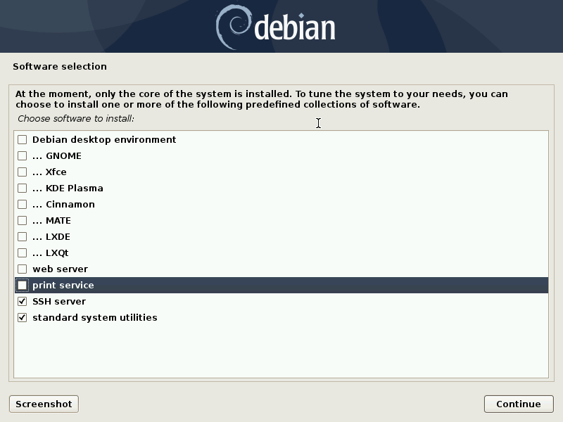

Installing a Debian unstable virtual machine
============================================

.. contents:: Page content
  :local:
  :backlinks: entry

.. highlight:: shell

.. index::
  pair: virtual machine; Debian
  single: QEMU
  single: KVM

Introduction
------------

These are my notes about the installation of a `virtual machine
<https://www.makeuseof.com/tag/virtual-machine-makeuseof-explains>`_ on my
`Debian GNU/Linux <https://www.debian.org>`_ stable system ("AMD64"
architecture). The installed virtual machine (the guest) is also a Debian
system, but the `unstable (also known as Sid)
<https://www.debian.org/releases/sid>`_ one.

Debian packages are available in unstable in more recent versions than in
stable. I wanted a Debian unstable virtual machine to be able to test the new
version of some packages.

Checking the virtualizations extensions presence on the CPU
-----------------------------------------------------------

.. index::
  pair: CPU; virtualization extensions
  pair: CPU; flags
  pair: proc filesystem; cpuinfo

If your hardware has virtualization support, then you should enable it **in the
BIOS**.

To know whether your hardware has virtualization support, issue the following
command. If it prints something, then your hardware has virtualization
support::

  grep "^flags\s*:" /proc/cpuinfo \
    | head -1 \
    | sed "s/^.\+:\s*//" \
    | sed "s/ \+/\n/g" \
    | grep "vmx\|svm"

Installing the libvirt family of tools
--------------------------------------

.. index::
  single: libvirt
  single: osinfo database
  pair: virsh commands; list
  pair: virsh commands; net-list

I install the `libvirt <https://libvirt.org>`_ family of tools **as root**
with::

  apt-get install virtinst libvirt-daemon-system libvirt-clients # As root.

The ``libvirt-clients`` package comes with the ``virsh`` program, to be used to
manage the virtual machines and get useful information. Examples
(**as root**)::

  virsh list --all     # List the virtual machines.
  virsh net-list --all # List the virtual networks.

The `osinfo <https://libosinfo.org>`_ and its querying tools are useful too::

  apt-get install libosinfo-bin # As root.

Preparing storage locations
---------------------------

For the virtual machine images
~~~~~~~~~~~~~~~~~~~~~~~~~~~~~~

.. index::
  single: mkdir
  pair: virsh commands; pool-list
  pair: virsh commands; pool-dumpxml
  pair: virsh commands; pool-edit
  pair: virsh commands; pool-define
  pair: virsh commands; pool-autostart
  pair: virsh commands; pool-start

The default location ("storage pool") for the virtual machines is
``/var/lib/libvirt/images``.

On some of my systems, the free space in ``/var`` is very limited. I want the
virtual machines to be located in my home directory instead. So I create a
directory with ``mkdir -p ~/vm/libvirt/images``. And then, **as root**, I do::

  chown root:root /home/my_user_name/vm/libvirt/images # Change directory
                                                       # ownership to root.

  chmod 711 /home/my_user_name/vm/libvirt/images       # Change permissions (no
                                                       # read/write permission
                                                       # for non-root users).

You can see the list of the storage pools managed by libvirt with::

  virsh pool-list # As root.

If this list is empty, then I define and start the default storage pool with::

  virsh pool-define-as default dir \
    --target /home/my_user_name/vm/libvirt/images # As root.
  virsh pool-autostart default                    # As root.
  virsh pool-start default                        # As root.

If the default storage pool is already existing, then I check the path with
``virsh pool-dumpxml default`` (**as root**) and change it if needed with::

  virsh pool-edit default # Edit the path and save.

After a reboot, ``virsh pool-dumpxml default`` (**as root**) shows the new
path.

For the installer ISO image
~~~~~~~~~~~~~~~~~~~~~~~~~~~

.. index::
  single: mkdir

Nothing complicated here, I just create a directory as an unprivileged user::

  mkdir -p ~/vm/installer_iso/debian_testing

Searching operating systems in the osinfo database
--------------------------------------------------

.. index::
  single: osinfo-query

When :ref:`creating the virtual machine with virt-install
<creating_debian_unstable_vm>`, it is recommended to provide the --os-variant
option. The possible values for that option are the short IDs provided by
command ``osinfo-query os``::

  osinfo-query os|less
  osinfo-query os|grep Debian

Getting a Debian testing installer image
----------------------------------------

.. index::
  triple: Debian; testing; installer
  single: wget

Debian testing installer images are available for download and updated daily
(for the small ("netinst") images at least).
See the `Debian installer page of the Debian developers' corner
<https://www.debian.org/devel/debian-installer/>`_.

You can download the "netinst" Debian testing installer image for the "AMD64"
architecture with::

  cd ~/vm/installer_iso/debian_testing
  wget https://cdimage.debian.org/cdimage/daily-builds/daily/arch-latest/amd64/iso-cd/debian-testing-amd64-netinst.iso

You might want to verify the authenticity of the ISO image. It is the same
process as for a
:ref:`Debian stable installer image <getting_debian_iso_image>`.

.. _creating_debian_unstable_vm:

Creating the Debian unstable virtual machine
--------------------------------------------

.. _start_debian_unstable_vm_install:

Start the installation
~~~~~~~~~~~~~~~~~~~~~~

.. index::
  single: virt-install
  single: Spice
  single: xhost
  pair: virsh commands; net-start
  pair: virsh commands; net-autostart

I enable the default virtual network **as root** with::

  virsh net-start default # As root.

You may want to set the default to start automatically::

  virsh net-autostart default # As root.

I make sure the applications running as root can connect to the X server::

  xhost +local: # As "normal" user.

Then I set and export the ``DISPLAY`` variable **as root**::

  export DISPLAY=:0.0 # As root.

I create the virtual machine **as root** with the following command (my working
directory was the one containing the Debian testing installer ISO image)::

  virt-install --name debian_unstable \
    --memory 1024 \
    --vcpus=1 \
    --cdrom debian-testing-amd64-netinst.iso \
    --disk pool=default,size=10 \
    --os-variant debiantesting \
    --graphics spice \
    --channel spicevmc & # As root.

Debian testing base installation
~~~~~~~~~~~~~~~~~~~~~~~~~~~~~~~~

.. index::
  single: virt-viewer

I proceed with the installation as I would for a "normal" Debian installation.
I choose the most simple disk partition scheme (all in a single partition) and
requires the installation of a SSH server.

Once the installation is complete, the virtual machine automatically restarts.
I launch ``virt-viewer`` (as root) to get a window to the virtual machine::

  virt-viewer debian_unstable & # As root.

Upgrade to Debian unstable
~~~~~~~~~~~~~~~~~~~~~~~~~~

.. index::
  single: /etc/apt/sources.list
  pair: apt-get commands; update
  pair: apt-get commands; dist-upgrade
  pair: Debian; unstable

The first step to upgrade to Debian unstable is to edit
``/etc/apt/sources.list`` (**as root, on the guest**):

* Substitute the Debian testing distribution name (which was "bullseye") with
  "unstable".
* Comment out any line containing ``security.debian.org``.

The second step is to execute::

  apt-get update; apt-get dist-upgrade # As root, on the guest.

Install X.org and Openbox
~~~~~~~~~~~~~~~~~~~~~~~~~

.. index::
  single: Openbox
  single: X.org
  single: X Window

I then install X.org and :doc:`Openbox <openbox_on_debian>` on
the virtual machine::

  apt-get install xorg openbox menu # As root, on the guest.

Enable copy'n'paste between host and guest
~~~~~~~~~~~~~~~~~~~~~~~~~~~~~~~~~~~~~~~~~~

.. index::
  pair: Spice; spice-vdagent

The package ``spice-vdagent`` enables copy'n'paste between host and guest::

  apt-get install spice-vdagent # As root, on the guest.

Configure display resolution
~~~~~~~~~~~~~~~~~~~~~~~~~~~~

.. index::
  single: /etc/X11/xorg.conf
  pair: X.org; Modelines
  pair: X.org; Modes
  single: X Window
  single: kill
  single: killall
  single: ps
  single: sleep

By default, X.org display resolution on the guest is 1024x768. I prefer
1920x1080 (which is the resolution of my monitor). So I create a specific X.org
configuration file (``/etc/X11/xorg.conf``, which does not exist by default).

The starting point is the file (``/root/xorg.conf.new``) that X.org generates
when this command is issued (**exit X.org first**)::

  Xorg -configure # As root, in the guest.

In ``/root/xorg.conf.new``, there is a ``Monitor`` section for a monitor with
identifier ``Monitor0``. I add "Modelines" in this section.

"Modelines" look like:

| Modeline     \"1024x768_24\"   65.00  1024 1048 1184 1344  768 771 777 806 -hsync -vsync
| Modeline     \"1920x1080_24\"  148.50  1920 2008 2052 2200  1080 1084 1089 1125 -hsync -vsync
| Modeline     \"1600x900_24\"  108.00  1600 1624 1704 1800 900 901 904 1000 +hsync +vsync

We can find the data that those "Modelines" are made of in a X.org log file
generated with (in this example, the file is called ``xlog.txt``)::

  Xorg -verbose 6 > xlog.txt 2>&1 # As root, on the guest.

This gets you in Xorg with no way to exit. Use the "Send key" menu item of
virt-viewer to send, say, "Ctrl-Alt-F3" and access a new console where you can
log in as root, find the process ID of Xorg with ``ps -ef|grep Xorg`` and kill
Xorg with a ``kill <process_id>`` command.

A more comfortable way of getting the X.org log file is to automatically kill
X.org after a few seconds. We need the ``killall`` command for that, provided
by the Debian package ``psmisc``::

  apt-get install psmisc # As root, on the guest.
  Xorg -verbose 6 > xlog.txt 2>&1 & sleep 3 && killall Xorg # As root, on the
                                                            # guest.

In ``xlog.txt``, we find lines like the following, which help building the
"Modelines":

| (II) qxl(0): Modeline \"1920x1080\"x60.0  148.50  1920 2008 2052 2200  1080 1084 1089 1125 -hsync -vsync (67.5 kHz eP)
| (II) qxl(0): Modeline \"1600x900\"x60.0  108.00  1600 1624 1704 1800  900 901 904 1000 +hsync +vsync (60.0 kHz e)
| (II) qxl(0): Modeline \"1024x768\"x60.0   65.00  1024 1048 1184 1344  768 771 777 806 -hsync -vsync (48.4 kHz e)

Once I have added the "Modelines" in ``/root/xorg.conf.new``, I edit the
``Screen`` section and add a ``Display`` subsection with a ``Modes`` line
matching the resolution I want:

| Section \"Screen\"
| 	Identifier \"Screen0\"
| 	Device     \"Card0\"
| 	Monitor    \"Monitor0\"
| 	SubSection \"Display\"
| 		Modes \"1920x1080\"
| 	EndSubSection
| EndSection

You can check that your ``/root/xorg.conf.new`` is a correct configuration file
with a test of X.org::

  Xorg -config /root/xorg.conf.new -retro # As root, on the guest.

or::

  Xorg -config /root/xorg.conf.new -retro & sleep 3 && killall Xorg # As root,
                                                                    # on the
                                                                    # guest.

The final step is to copy ``/root/xorg.conf.new`` to ``/etc/X11/xorg.conf``::

  cp xorg.conf.new /etc/X11/xorg.conf # As root, on the guest.

You can :download:`download this xorg.conf file
<download/debian_vm_xorg.conf>`.

Reboot
~~~~~~

.. index::
  pair: systemctl commands; reboot

At this point, I reboot (or else the keyboard layout in X.org may not be the
expected one)::

  systemctl poweroff # As root, on the guest.

I then login as a normal user and starts X.org and Openbox with::

  startx

Shutting down and restarting the virtual machine
------------------------------------------------

.. index::
  pair: systemctl commands; poweroff
  pair: virsh commands; start
  pair: virsh commands; shutdown
  pair: virsh commands; destroy
  single: virt-viewer
  single: xhost

To shut down the virtual machine, I just do as for a "real" machine. For
example::

  systemctl poweroff # As root, on the guest.

Alternatively, this ``virsh`` command run from the host should also shut down
the virtual machine::

  virsh shutdown debian_unstable # As root.

If it's not enough::

  virsh destroy debian_unstable # As root.

To restart the virtual machine I do::

  virsh start debian_unstable # As root.
  virt-viewer debian_unstable # As root.

or, if I want the viewer in full screen mode::

  virt-viewer -f debian_unstable # As root.

Again, you need to make sure the applications running as root can connect to
the X server, so you may have to do (prior to launching ``virt-viewer``)::

  xhost +local: # As "normal" user.

and::

  export DISPLAY=:0.0 # As root.

Finding the IP address of the virtual machine
---------------------------------------------

.. index:
  single: IP address
  single: iproute2
  pair: ip commands; addr
  single: net-tools
  single: ifconfig
  pair: virsh commands; net-dhcp-leases

Having the IP address of the virtual machine is useful, for example to connect
to it from the host via :doc:`SSH <ssh>`.

On a Debian GNU/Linux system, you probably have the ``iproute2`` package
installed. In this case, the following command should show (among other
information) the IP address::

  ip addr # On the guest.

If you don't have the ``ip`` command, you may have the ``ifconfig`` command
(provided by package ``net-tools`` on a Debian GNU/Linux system) which does
show (among other information) the IP address::

  ifconfig # On the guest.

Alternatively, you should be able to get the IP address of a guest without
login into the guest, using ``virsh``::

  virsh net-dhcp-leases default # As root, on the host.

Removing the virtual machine
----------------------------

.. index::
  pair: virsh commands; undefine
  pair: virsh commands; vol-delete

Once shutdown, the virtual machine can be entirely removed with these
commands::

  virsh undefine debian_unstable # As root.
  virsh vol-delete --pool default debian_unstable.qcow2 # As root.

Other resources
---------------

* `Difference between KVM and QEMU (on serverfault.com)
  <https://serverfault.com/questions/208693/difference-between-kvm-and-qemu>`_
* `qemu:///system vs qemu:///session (--connect option to virt-install)
  <https://blog.wikichoon.com/2016/01/qemusystem-vs-qemusession.html>`_
* `libvirt networking handbook
  <https://jamielinux.com/docs/libvirt-networking-handbook/index-full.html>`_
