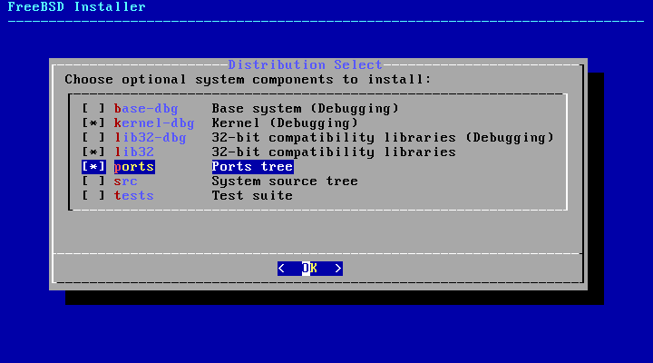

Installing a FreeBSD virtual machine
====================================

.. contents:: Page content
  :local:
  :backlinks: entry

.. highlight:: shell

.. index::
  pair: virtual machine; FreeBSD
  single: QEMU
  single: KVM

Introduction
------------

These are my notes about the installation of a `FreeBSD
<https://www.freebsd.org>`_ 12.1 virtual machine on my `Debian GNU/Linux
<https://www.debian.org>`_ stable system ("AMD64" architecture).

The process is very similar to :doc:`the installation of a Debian GNU/Linux
virtual machine <debian_unstable_vm>` and this page does not repeat all the
details and mentions only the specific actions.

If you're looking for information about the post-install configuration and
usage of the FreeBSD system, the :doc:`"My first steps with FreeBSD" page
<first_steps_with_freebsd>` may be more interesting.

Getting and verifying the FreeBSD installer ISO image
-----------------------------------------------------

.. index::
  single: mkdir
  single: wget
  single: sha512sum

Here are the commands I use to download the installer image and the other files
needed for the verification::

  mkdir -p ~/vm/installer_iso/freebsd_12.1
  cd ~/vm/installer_iso/freebsd_12.1
  wget https://download.freebsd.org/ftp/releases/amd64/amd64/ISO-IMAGES/12.1/FreeBSD-12.1-RELEASE-amd64-bootonly.iso
  wget https://download.freebsd.org/ftp/releases/amd64/amd64/ISO-IMAGES/12.1/CHECKSUM.SHA512-FreeBSD-12.1-RELEASE-amd64

Then I do the verification with::

  sha512sum -c --ignore-missing CHECKSUM.SHA512-FreeBSD-12.1-RELEASE-amd64

Creating the FreeBSD virtual machine
------------------------------------

Start the installation
~~~~~~~~~~~~~~~~~~~~~~

.. index::
  single: virt-install
  single: osinfo-query

It consists in running a ``virt-install`` command, very much like for the
:ref:`Debian unstable virtual machine creation
<start_debian_unstable_vm_install>`.

Don't forget to :ref:`start the default virtual network and to run the needed
commands so that applications running as root can connect to the X server
<start_debian_unstable_vm_install>`.

Use ``osinfo-query os`` to find the most appropriate value for the
``--os-variant`` option (the closest value to the OS you're installing).

Here is the exact ``virt-install`` command I use::

  virt-install --name freebsd_12.1 \
    --memory 1024 \
    --vcpus=1 \
    --cdrom FreeBSD-12.1-RELEASE-amd64-bootonly.iso \
    --disk pool=default,size=10 \
    --os-variant freebsd11.2 \
    --graphics spice \
    --channel spicevmc & # As root.

During the installation, I installed the components selected by default plus
the ports tree.

FreeBSD base installation
~~~~~~~~~~~~~~~~~~~~~~~~~

Not much to say here. I haven't had any major difficulty doing the base
installation.
